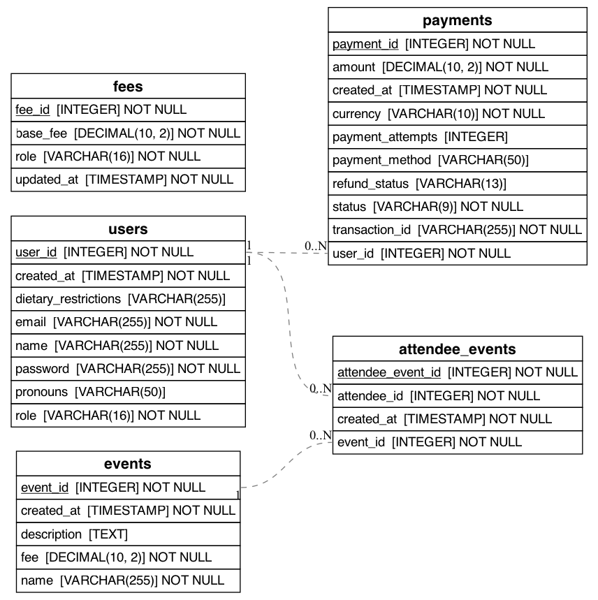

# Backend Folder

All database, routes, stripe integration security is managed here.
## Server Information
Server defaults to running on port 8080 and will close on unhandled promise rejections or uncaught exception.

### Running The Server
1. Build the application

~~~
npm install
~~~

2. Run the application

~~~
npm start
~~~

3. Use the devices public address and the port the server is running on to access the site.

## Routes Information
For organization and security the routes avalible in the API are divided up into several route files.

>[!IMPORTANT]
>
>The routes are described bellow are formated as follows: Route | Method | Inputs | Action(s)
>
>Bold are the specific value names 
>
>All Errors or failures retrun a **message**, errors can also include an **error** in the body.
### Admin Routes
- /api/admin/login **|**
POST **|**
Body containts an **email** and **password** field **|**
Authenticates Admin credentials and returns either an error if something was wrong or went wrong, or a body containing the **admin** information (**email** and **full_name**) and the **success** state.

- /api/admin/events **|**
GET **|**
None **|**
Returns a list of all events ordered by type contained in a body as **events**.

- /api/events **|**
POST **|**
A Body containing **name**, **description**, **event_type**, **fee** and **date** **|**
Adds an event with the given information and returns the infromation along with the new **event_id**

- /api/events/:id **|**
PUT **|**
takes an **id** parameter with a body containing **name**, **description**, **event_type**, **fee** and **date** **|**
Updates the event of the given id and returns back the updated **name**, **description**, **event_type**, **fee** and **date**

- /api/events/:id **|**
DELETE **|**
takes an **id** parameter **|**
Deletes the event associated with the ID and returns a body with a **message** indicating whether it was successful.

### Attendee Routes
<!-- Register for an event -->
- /api/attendee_events **|**
POST **|**
A body containing **attendee_id** and **event_id** **|**
Alway returns a body with **success** and **message** describing whether the user could be signed up for the event.

<!-- GET all events for an attendee -->
- /api/attendee_events/:attendee_id **|**
GET **|**
**attendee_id** **|**
always returns **success** and will return any **events** if any are listed for the attendee.

### Event Routes
- /api/events **|**
GET **|**
None **|**
Returns a body with the **events** in the database and the associated fees as appropriately selected (author, regular, and optional)

### Fee Routes
- /api/fees **|**
GET **|**
None **|**
output/action

- /api/fees/:id **|**
PUT **|**
Parameter **id** the fee ID, and a Body containing the **base_fee** and **role** **|**
Always returns a body with **success** and **message** which signal if the fee at the ID was updated.

- /api/calculate-fee **|**
POST **|**
A body containing **role** and **selectedEvents** **|**
Returns the calculated **baseFee**, **optionalEventFee**, and **totalFee** for the selected events with the given role, useable for calculating the estimated cost of ticket orders.

### Payment Routes
- /api/payments/test **|**
GET **|**
None **|**
Sends a **message** if the payments route is working

- /api/payments/confirm **|**
POST **|**
A body with a stripe **clientSecret** **|**
Returns a body with **success**, **tickets**, **paymentId**, **totalAmount**, **currency**, and **purchaseDate** if success payment has gone through and has a **details** body field if something goes wrong. 

- /api/payment/create-intent **|**
POST **|**
A body containing **amount** and **userId**  **|**
Returns a body with **clientSecret** if successful in adding an amount to the future payment and has a **details** body field if something goes wrong. 

- /api/payment/record **|**
POST **|**
A body with **userId**, **amount**, **transaction_id**, **payment_method**, and **status** **|**
Adds successful payments to the database and returns a body with **success**.

- /api/payment/history/:userId **|**
GET **|**
Parameter of a **userId** **|**
Returns a body with the **payments** history of the userId unless something goes wrong.

- /api/payment/webhook **|**
POST **|**
A header with a **stripe-signature** **|**
Creates a webhook to handle stripe events, returns a body with **received** if it succeeds.

### User Routes
- /api **|**
GET **|**
None **|**
Returns a **message** that the API is running

- /api/users **|**
GET **|**
None **|**
Returns **success** and **users** from the database inquiry.

- /api/users/:id **|**
GET **|**
Parameter **id** **|**
Returns **success** and either the **user** data or a message saying it wasn't found

- /api/registeruser **|**
POST **|**
A body containing **name**, **email**, **password**, **pronouns**, **dietary_restrictions**, and **role** **|**
A body with **success** and a **message** based on if the user could be created.

- /api/users/:id **|**
PUT **|**
Parameter **id** and a body containing **name**, **email**, **password**, **pronouns**, **dietary_restrictions**, and **role** **|**
Updates the user of the id and returns a **success** status and **message** based on if it worked.

- /api/users/:id **|**
DELETE **|**
Parameter **id** **|**
Deletes the user of the id and returns a **success** status and **message** based on if it worked.

- /api/checkUser **|**
POST **|**
A body containing **email** **|**
Returns whether a user with that email **exists** in the database.

- /api/login **|**
POST **|**
A body containing **email** and **password** **|**
Attempts to sign in and returns a **success** and **message**, then if it succeeds it also sends **userId** and **role**.

- /api/user/tickets/:userId **|**
GET **|**
Parameter **userId**  **|**
Searches for userId connected to tickets, retruns a **success** value and the **tickets** if it works.

## Database Information

### Database Schema

### Database Table Descriptions

#### USERS
Holds information relevant to app user accounts.
Role determins the fees that influence the tickets
Rest are what you might expect.

#### FEES
Holds information on different fees.
Role is the role which a fee is applied to.
Base_fee is the cost of the fee.
Updated_at is the last time it was updated.

#### EVENTS
Holds information for the events.
Created_at is the date of the events creation.
Fee is the cost of the event.

#### PAYMENTS
Holds information related to payments.
Transaction_id is the paymentIntentId used by Stripe.
Payment_method is the means by which was paid (card or whatever other methods are accepted).
Amount is the amount paid.

#### ATTENDEE EVENTS
Holds the information on who is signed up to attend what event(s).
Can be used to verify who has a ticket.